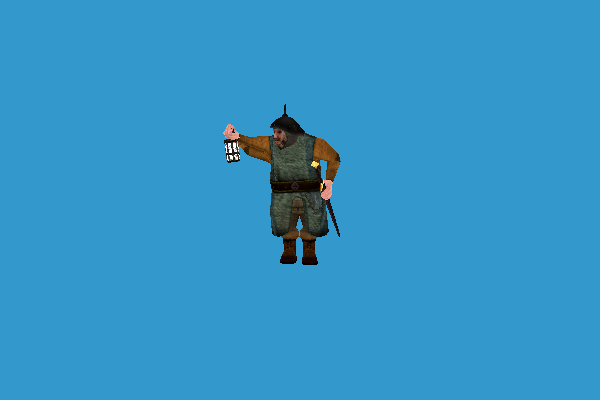

# GPU skinning using quaternions

## Intro

During development of animation tool, I got to the point where I wanted to move the most of the parts to GPU. I have heard a lot of stories from 'experts' stating that GPU skinning using quaternions is inefficient. It is simply not true. I have browsed through lots of GPU skinning examples but all of them used matrices or matrix palettes at best. Some of them used quaternions and then converted them to matrices for upload to GPU, this was inefficient in the terms of speed, memory, and usefulness.

To demonstrate the simplicity of this solution, I wrote this example.

The quaternions are used through the entire code and are never converted to matrices. The inverse bone data is used in quaternion - translation form. The animation is interpolated between the animation frames using quaternions. The shader code calculates the skinning based on weights in exactly same way matrices, only using quaternions. 

## Screenshots

## Info

Using a pair of quaternion - translation uses half of the uniform space to describe the joints positions. This enables to double the number of joints but limits the capabilities of the presentation. There is no skew nor size changing available. There is a simple way to use empty position uniform (pos.w) value to describe some additional behavior, for example, bone scale. 

## Formats

- Doom 3 (id Tech 4) MD5
- Spine 2d JSON (soon, wip)

## Issues

- The code around this example was made very quickly using borrowed parts from here and there. Do not use it in production or clowns will eat you.
- Somewhere along the way, I used something inappropriate and it makes my Intel HD 3000 vomit strange stuff on the screen. It is not related to quaternions itself. If you have an older laptop (like I do) just start the example using more powerful GPU.

## Dependences

I usually put the dependencies in an external folder and I use environment variable KUN_EXT_SDK for path access.

- GLM
- SOIL2
- GLEW
- GLFW

## Licensing

I hope no one of people who recognize their code will stab me. I included the model found on the web in other examples, with a bit of luck it was freeware.
